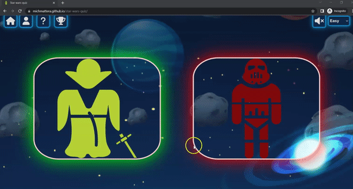
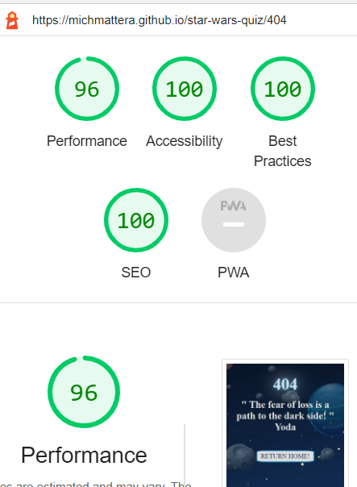

# **STAR WARS QUIZ TESTING**  

[Read Me file](/README.md)

[View Github repository](https://github.com/michmattera/star-wars-quiz)

[View the live project here](https://michmattera.github.io/star-wars-quiz/)

## **Table of contents**
***
1. [Browser Testing](#browser-testing)
2. [Manual Testing](#manual-Testing)
    1. [Navigation Buttons](#navigation-buttons)
    2. [Main game](#main-game)
    3. [Social-Media](#social-media)
3. [Code validator](#code-validator)
     1. [Lighthouse](#lighthouse)
4. [Responsive](#responsive)

## **Browser testing**

The following browser have been tested and check:

| Browser | Checked |
| --- | --- |
| Google chrome | :heavy_check_mark: |
| Microdoft edge | :heavy_check_mark: |
| Safari|  :heavy_check_mark: |
| Firefox | :heavy_check_mark: |
| Opera | :heavy_check_mark:|

 Google Chrome:

 Microsoft Edge:

 Safari:

 Firefox:

 Opera:

## **Manual testing**

### **Navigation buttons**

All navigation buttons have been tested and checked :

| Button | Checked |
| --- | --- |
| Levels | :heavy_check_mark: |
| Sound | :heavy_check_mark: |
| Instruction|  :heavy_check_mark: |
| Leaderboard | :heavy_check_mark: |
| Username | :heavy_check_mark:|
| Home | :heavy_check_mark:|

 Levels : Tested that when clicked the level form would show other difficulty and change the difficulty 

 Sound :

 Instruction : Tested when clicked button for instruction modal will open and display instruction , closing instruction clicking the close button.

Leaderboard : Tested if button when clicked will open modal with two different lists and will display correctly username and score after save it in local storage:

 Leaderboard when inserting username - save - play light game - save score -clicking leaderboard light to see displayed the score with username

 Leaderboard when inserting username - save - play dark game - save score -clicking leaderboard dark to see displayed the score with username

 Username : Tested if when clicked on username open modal, if clicked save button was disabled if input was empty and not disabled if not empty. In addition clicking the save button will close the window as well.

 Home : Tested home button that at any time during the game will bring the user to homepage.

### **Main game**

Main game was tested in the following categories :

1. Difficulty 
2. Colors
3. Final buttons
4. Score

| Features | Checked |
| --- | --- |
| Difficulty | :heavy_check_mark: |
| Colors | :heavy_check_mark: |
| Final Buttons|  :heavy_check_mark: |
| Score | :heavy_check_mark: |

The levels :
- Easy : Easy difficulty displays a total of 7 questions.
- Medium : Medium difficulty displays a total of 11 questions.
- Difficult : Difficult difficulty displays a total of 15 questions.

Colors :
- every time you click on start light game all buttons will display green border , and final message in green.
- every time you click on start dark game all buttons will display red border , and final message in red.

Score :
- for each correct answer the button will display green background color, with blue text.
- for each wrong answer the button will display red background color, andwhite text.
- As well for each correct and incorrect answer at the bottom will appear small divs if correct green and if wrong red.

The following 2 videos will display the following test: Level - Colors - Score.

 Light Game : Tested button to start light game , all colors changed , score is correct and final message of the right color checked.

 Dark Game : Tested button to start dark game , all colors changed , score is correct and final message of the right color checked.

The final buttons are three , the user chose between restart same game , change side directly without going to homepage first , and save score that will reload page and bring user home , with local storage updated. In adition the button to change levl with the final message is not disabled so user when clicking change difficulty as well.

 Restart : Tested when click the restart button user restart same game (optional = change level ).

 Change side : Tested when click the change side button user go directly to the other side of the game, if playing light then it goes to dark side and viceversa (optional = change level ).

### **Social media**

Social media situated just at the bottom of the page bring the user to social media of the developer , both opens in a new page.

 Github : Tested button with hover effect and that opens in a new page when clicked.

 Linkedin : Tested button with hover effect and that opens in a new page when clicked.

## Code validator

All code passed throught validator:

1. Css 

 Css validator checked

2. Html

 index.html

 404.html

 500.html

3. Javascript files : all javascript file was passed throught jshint , with just 1 warning ( 34	Functions declared within loops referencing an outer scoped variable may lead to confusing semantics. (runLightGame, runDarkGame), decided to not change functions because of not enough time and believing that the function and the variable are understandable)

Javascript

### **Lighthouse**

Lighthouse was checked on every page with desktop and cellphone.

Desktop: 

Index.html desktop

404.html desktop

500.html desktop

Mobile :

Index.html mobile

404.html mobile

500.html mobile

## **Responsive**

The responsiveness of the website was checked and recorded. Website fully responsive from screen bigger than 1500 px to 280px minimum width screen.

Responsive

[Back to top](#star-wars-quiz-testing)

***